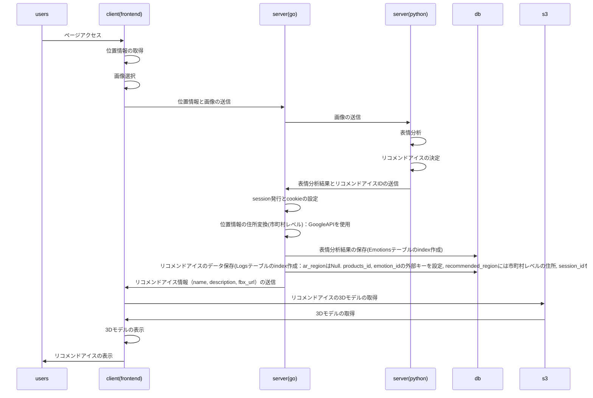
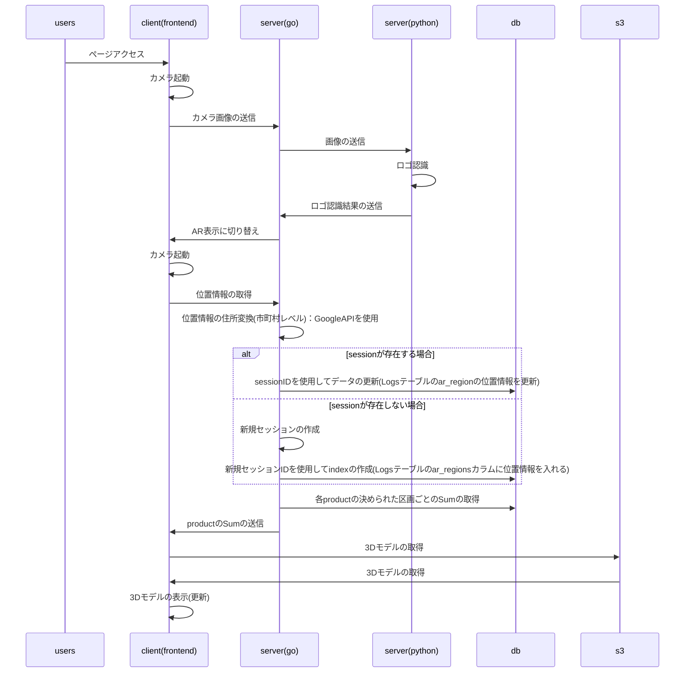

# face_recommendation
表情分析によるアイスのリコメンド機能のシーケンス図です。

```mermaid
sequenceDiagram
  participant users
  participant client(frontend)
  participant server(go)
  participant server(python)
  participant db
  participant s3 
      
  users->>client(frontend): ページアクセス
  client(frontend)->>client(frontend): 位置情報の取得
  client(frontend)->>client(frontend): 画像選択
  client(frontend)->>server(go): 位置情報と画像の送信
  server(go)->>server(python): 画像の送信
  server(python)->>server(python): 表情分析
  server(python)->>server(python): リコメンドアイスの決定
  server(python)->>server(go): 表情分析結果とリコメンドアイスIDの送信
  server(go)->>server(go): session発行とcookieの設定
  server(go)->>server(go): 位置情報の住所変換(市町村レベル)：GoogleAPIを使用
  server(go)->>db: 表情分析結果の保存(Emotionsテーブルのindex作成)
  server(go)->>db: リコメンドアイスのデータ保存(Logsテーブルのindex作成：ar_regionはNull. products_id, emotion_idの外部キーを設定, recommended_regionには市町村レベルの住所, session_idを設定)
  server(go)->>client(frontend): リコメンドアイス情報（name, description, fbx_url）の送信
  client(frontend)->>s3: リコメンドアイスの3Dモデルの取得
  s3->>client(frontend): 3Dモデルの取得
  client(frontend)->>client(frontend): 3Dモデルの表示
  client(frontend)->>users: リコメンドアイスの表示
```

# ar_vending_machine
自販機のロゴからAR表示機能のシーケンス図です。

```mermaid
sequenceDiagram
  participant users
  participant client(frontend)
  participant server(go)
  participant server(python)
  participant db
  participant s3 
      
  users->>client(frontend): ページアクセス
  client(frontend)->>client(frontend): カメラ起動
  client(frontend)->>server(go): カメラ画像の送信
  server(go)->>server(python): 画像の送信
  server(python)->>server(python): ロゴ認識
  server(python)->>server(go): ロゴ認識結果の送信
  server(go)->>client(frontend): AR表示に切り替え
  
  client(frontend)->>client(frontend): カメラ起動
  client(frontend)->>server(go): 位置情報の取得
  server(go)->>server(go): 位置情報の住所変換(市町村レベル)：GoogleAPIを使用
  alt sessionが存在する場合
    server(go)->>db: sessionIDを使用してデータの更新(Logsテーブルのar_regionの位置情報を更新)
  else sessionが存在しない場合
    server(go)->>server(go): 新規セッションの作成
    server(go)->>db: 新規セッションIDを使用してindexの作成(Logsテーブルのar_regionsカラムに位置情報を入れる)
  end
  server(go)->>db: 各productの決められた区画ごとのSumの取得
  server(go)->>client(frontend): productのSumの送信
  client(frontend)->>s3: 3Dモデルの取得
  s3->>client(frontend): 3Dモデルの取得
  client(frontend)->>client(frontend): 3Dモデルの表示(更新)
```